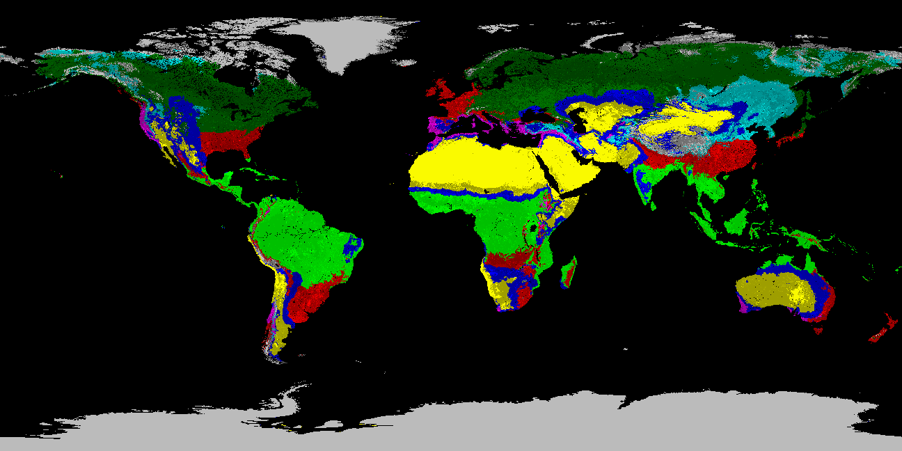

## Process spatial climate maps

Code in this repository extracts land area data from spatial maps for use in climate solution models.

The output of this code is:
+ a series of CSV files, with a row per country or region and column per data class. Country and region names are normalized to those used in [Project Drawdown](https://drawdown.org). Data is calculated per country, correcting for WGS84 projection.  
+ GeoTIFF files of the Project Drawdown Thermal Moisture Regime + Agro-Ecological Zone, as well as files for each component which goes into the classification. In addtition, PNG files downsampled to 5% resolution are provided for easy web viewing.  

## Data Sources
Note that the data processed in this repository comes from external sources, most of which require
attribution in the form of a citation of their contribution. Please see LICENSE.md for details and links.

### [Köppen-Geiger](https://en.wikipedia.org/wiki/K%C3%B6ppen_climate_classification)
Data files come from the Nature article
["Present and future Köppen-Geiger climate classification maps at 1-km resolution"](https://www.nature.com/articles/sdata2018214.pdf).

[Data files from the paper](http://www.gloh2o.org/koppen/) retrieved 22 Aug 2019.

### Land Cover
Data comes from the [European Space Agency Climate Change Initiative](http://maps.elie.ucl.ac.be/CCI/viewer/download.php), supported by the [Copernicus Climate Change Service (C3S) Climate Data Store (CDS)](https://cds.climate.copernicus.eu/cdsapp#!/dataset/satellite-land-cover?tab=overview).

2018 NetCDF file C3S-LC-L4-LCCS-Map-300m-P1Y-2018-v2.1.1.nc retrieved 13 Dec 2019.

### Slope
Data comes from [FAO Supplementary Data for the Harmonized World Soil Database](http://webarchive.iiasa.ac.at/Research/LUC/External-World-soil-database/HTML/global-terrain-slope-download.html), downloaded Oct 24, 2019.

FAO slope data extends to 60° North to South. Outside of this range, slope data is supplied by [Geomorpho90m](https://peerj.com/preprints/27595/), which is generated from [MERIT-DEM data](http://hydro.iis.u-tokyo.ac.jp/~yamadai/MERIT_DEM/). Classified Slope GeoTIFF in data/geomorpho90m/classified\_slope\_merit\_dem\_1km\_s0..0cm\_2018\_v1.0.tif produced 09 Oct 2019 from the tar.gz files retrieved from [Geomorpho90m Google Drive](https://drive.google.com/drive/folders/1D4YHUycBBhNFVVsz4ohaJI7QXV9BEh94) 06 Oct 2019. Note that the original slope files from Geomorpho90m are tens of GBytes in size, which exceeds the 2GB LFS maximum file size which Github allows and is therefore not checked in to this repository. The generated GeoTIFF file with slopes classified into their GAEZ3.0 bins compresses better and fits within the Github limits.

### Soil Workability
Data comes from the [United Nations Food and Agriculture Organization sq7 ASC file](http://www.fao.org/soils-portal/soil-survey/soil-maps-and-databases/harmonized-world-soil-database-v12/en/) retrieved 25 Sep 2019, converted to GeoTIFF using a procedure described in data/FAO/README.txt.

### Administrative Boundaries
World maps are processed into administrative boundaries using shapefiles provided by [Natural Earth](https://www.naturalearthdata.com).

[Natural Earth topology files](https://www.naturalearthdata.com/downloads/) retrieved 22 Aug 2019.
